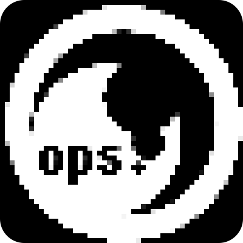

<p align="center">
    
</p>

# ops

<p align="center">
  
  
  
  
  
</p>


[Opservatory](https://github.com/subatiq/opservatory) CLI

To use, deploy or use a deployed instance of Opservatory.

For more docs on Opservatory, go [here](https://subatiq.github.io/opservatory/)

---

## Install

```
pip install opservatory-cli
```


## Configure opservatory server

```
ops setup
```

In following prompts enter Opservatory server IP or hostname and port (80 by default). Configuration will be saved at `~/.ops/config.json`

## Check config 

```
ops config
```

The output will show the contents of the `config.json`.

## Finding free machines

```
ops free
```

Output will show the list of all free machines with specs. To show only IP addresses and basic info as hostname and CPU, execute:

```
ops free --compact
```

## Finding busy machines

Works the same as `ops free`:

```
ops busy
```


